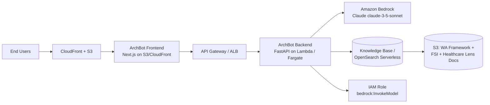

# ArchBot — AI-Powered AWS Architecture Advisor

> Describe your workload in plain English. Get back a reference architecture, a Well-Architected review, and a Mermaid diagram — powered by Amazon Bedrock (Claude) and a RAG pipeline over AWS Well-Architected Framework documentation.

[](https://github.com/Konstantinos-Mavridis/aws-archbot/actions/workflows/ci.yml)
[](https://github.com/Konstantinos-Mavridis/aws-archbot/actions/workflows/cdk-deploy.yml)
[](LICENSE)

---

## What It Does

A user submits a free-text workload description with optional non-functional requirements (SLA, regions, RTO/RPO) and selects an architecture lens. ArchBot returns:

| Output | Description |
|---|---|
| **Architecture narrative** | Tiers, service choices, trade-offs |
| **Service recommendations** | Per-category (compute, storage, networking…) with reasoning |
| **Mermaid diagram** | Renderable in GitHub and the frontend |
| **Well-Architected checklist** | Risk-flagged items across all six pillars |
| **Cost tiers** | Qualitative estimates for dev / staging / prod |

**Lens toggle**: `General` / `Financial Services (FSI)` / `Healthcare` — changes which WA documents are retrieved and adds lens-specific compliance checks.

---

## System Architecture



---

## Repository Structure

```text
.
├── backend/
│   ├── app/
│   │   ├── main.py            # FastAPI app + Lambda handler
│   │   ├── rag_pipeline.py    # Retrieval + Bedrock orchestration
│   │   ├── models.py          # Pydantic I/O schemas
│   │   └── cost_estimator.py  # Qualitative cost heuristics
│   ├── scripts/
│   │   └── ingest_docs.py     # One-time WA doc ingestion script
│   ├── tests/
│   │   ├── test_rag_pipeline.py
│   │   └── test_models.py
│   ├── pyproject.toml
│   └── README.md
├── frontend/
│   ├── app/                   # Next.js App Router
│   │   ├── layout.tsx
│   │   ├── page.tsx
│   │   └── components/
│   ├── package.json
│   └── README.md
├── infra/
│   └── cdk/
│       ├── app.py
│       ├── stacks/
│       │   ├── backend_stack.py
│       │   ├── rag_stack.py
│       │   └── frontend_stack.py
│       └── cdk.json
├── docs/
│   ├── adr/
│   │   ├── 0001-architecture-overview.md
│   │   ├── 0002-rag-store-choice.md
│   │   └── 0003-deployment-strategy.md
│   └── well-architected-checklist-example.md
├── .github/
│   └── workflows/
│       ├── ci.yml
│       └── cdk-deploy.yml
└── README.md
```

---

## Quickstart

### Prerequisites

- Python 3.12+
- Node.js 20+
- AWS CLI configured with appropriate permissions
- AWS CDK CLI: `npm install -g aws-cdk`
- Access to Amazon Bedrock (Claude model enabled in your AWS account)

### Backend (local dev)

```bash
cd backend
pip install -e '.[dev]'
uvicorn app.main:app --reload
# API available at http://localhost:8000
# Docs at http://localhost:8000/docs
```

### Frontend (local dev)

```bash
cd frontend
npm install
npm run dev
# App available at http://localhost:3000
```

### Ingest WA documents (one-time)

```bash
cd backend
python scripts/ingest_docs.py --lens general
python scripts/ingest_docs.py --lens fsi
python scripts/ingest_docs.py --lens healthcare
```

### Deploy with CDK

```bash
# 1. Build the frontend static export first — CDK FrontendStack bundles it
cd frontend && npm ci && npm run build && cd ..

# 2. Bootstrap (once per account/region), then deploy
cd infra/cdk
pip install -r requirements.txt
cdk bootstrap          # once per account/region
cdk synth
cdk diff
cdk deploy --all
```

> **Note:** Running `cdk synth` or `cdk deploy` without a `frontend/out/` directory will
> produce a `DeployWebsite skipped` warning from the FrontendStack. Always run
> `npm run build` in `frontend/` first.

---

## Architecture Decision Records

| # | Title | Status |
|---|---|---|
| [0001](docs/adr/0001-architecture-overview.md) | Overall architecture style | Accepted |
| [0002](docs/adr/0002-rag-store-choice.md) | RAG store: Bedrock KB vs OpenSearch | Accepted |
| [0003](docs/adr/0003-deployment-strategy.md) | Deployment & environment strategy | Accepted |

---

## Well-Architected Pillars Coverage

| Pillar | General Lens | FSI Lens | Healthcare Lens |
|---|---|---|---|
| Operational Excellence | ✅ | ✅ | ✅ |
| Security | ✅ | ✅ + KMS, SoD, audit | ✅ + PHI, de-id |
| Reliability | ✅ | ✅ + data residency | ✅ |
| Performance Efficiency | ✅ | ✅ | ✅ |
| Cost Optimization | ✅ | ✅ | ✅ |
| Sustainability | ✅ | ✅ | ✅ |

---

## Contributing

PRs welcome. Please open an issue first for significant changes. See [docs/adr/](docs/adr/) for the reasoning behind key architectural choices.

## License

MIT — see [LICENSE](LICENSE).
